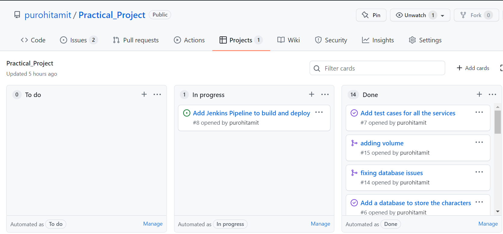

# Practical_Project

Project Objective:

The objective of this project is to create an application that generates a random race, class and weapon to help you start your journey in Dungeons & Dragons. This application is composed of 4 services that work together. 

Architecture:

Service #1
The core service – this will render the Jinja2 templates we need to interact with the application, it will also be responsible for communicating with the other 3 services, and finally for persisting some data in an SQL database.

Service #2 + #3
These will both generate a random “Object”, in this case service 2 will create the race object and service 3 will create the claas object.

Service #4
This service will also create an “Object” however this “Object” is based upon the results of service #2 + #3 using some pre-defined rules, in this case service 4 will create a weapon object based on the race and claas object generated by service 2 and service 3.

Planning:

I used git for the version control and as the repository was hosted on Github, I used it's Project feature for the project tracking. The whole project was broken down into 8 tasks so 8 issues were created. Every time the task was completed and was pushed to github repo, the issue was automatically closed which was linked to the project. Below are the pictures taken at the start and after completing all the tasks.

