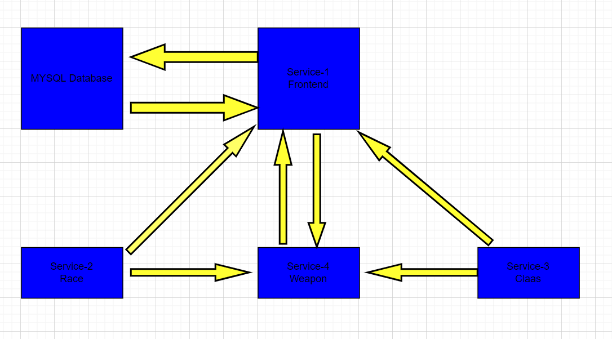
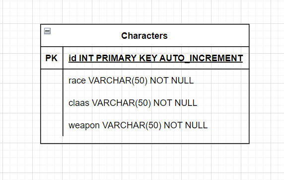
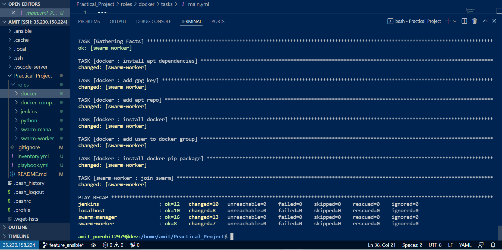
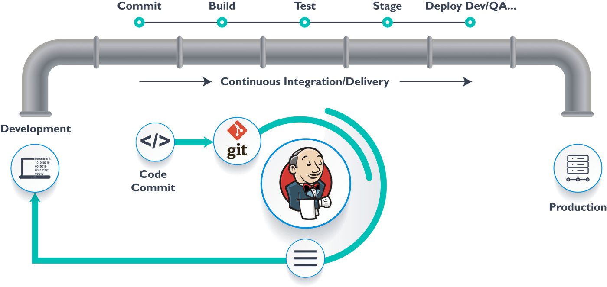
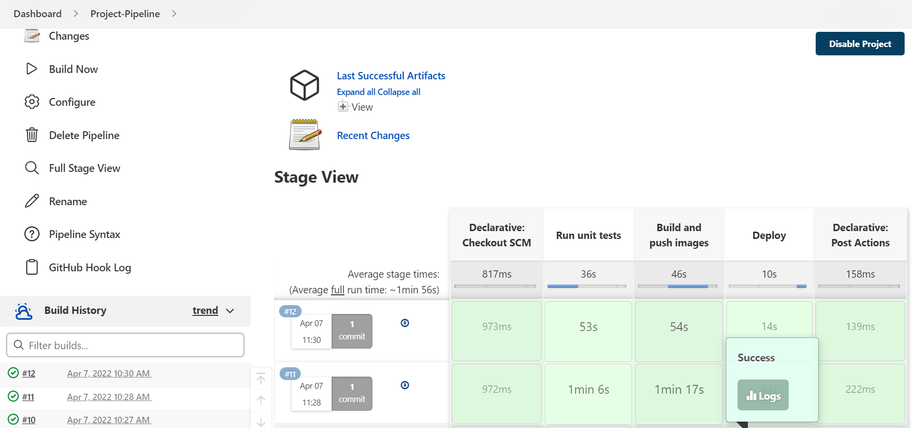
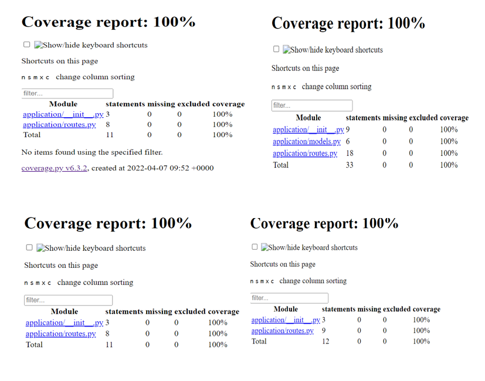
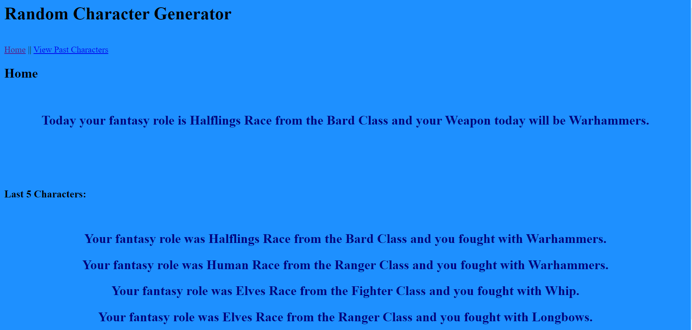
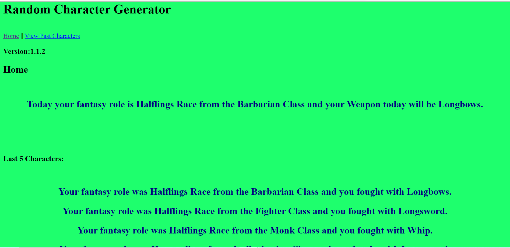

# Practical_Project

## Contents

- [Introduction](#Introduction)
- [Project Objective](#Project-Objective)
- [Architecture](#Architecture)
- [Entity Relationship Diagram](#Entity-Relationship-Diagram)
- [Project Tracking](#Project-Tracking)
- [Risk Assessment](#Risk-Assessment)
- [Ansible](#Ansible)
- [CI Pipeline](#CI-Pipeline)
- [Testing](#Testing)
- [Development](#Development)
- [Points of Improvement](#Points-of-Improvement)
- [Acknowledgements](#Acknowledgements)

## Introduction

## Project Objective:

The objective of this project is to create an application that generates a random race, class and weapon to help you start your journey in Dungeons & Dragons. This application is composed of 4 services that work together. 

## Architecture:

Service #1
The core service – this will render the Jinja2 templates we need to interact with the application, it will also be responsible for communicating with the other 3 services, and finally for persisting some data in an SQL database.

Service #2 + #3
These will both generate a random “Object”, in this case service 2 will create the race object and service 3 will create the claas object.

Service #4
This service will also create an “Object” however this “Object” is based upon the results of service #2 + #3 using some pre-defined rules, in this case service 4 will create a weapon object based on the race and claas object generated by service 2 and service 3.

In addition, the project is expected to utilise the following technologies:

- Kanban Board: Asana or an equivalent Kanban Board
- Version Control: Git
- CI Server: Jenkins
- Configuration Management: Ansible
- Cloud server: GCP virtual machines
- Containerisation: Docker
- Orchestration Tool: Docker Swarm
- Reverse Proxy: NGINX

## Entity Relationship Diagram:

An erd was created using io to show the table and the fields used in the table:

## Project Tracking:

I used git for the version control and as the repository was hosted on Github, I used it's Project feature for the project tracking. The whole project was broken down into 8 tasks so 8 issues were created. Every time the task was completed and was pushed to github repo, the issue was automatically closed which was linked to the project. Below are the pictures taken at the start and after completing all the tasks.

## Risk Assessment:

A standard risk assessment was carried out at the start of the project as per the below:

## Ansible:

Ansible was used to configure my all the vms. A role was created for each of the configuration required by the VMs. So instead if going on each VM and installing Docker individually and the then the other requirements, an Ansible playbook was created which automated this task and reduced a lot of time and removed the chances of error.

## CI Pipeline:

Jenkins was used for the continious integration and continuous delivery which automatically ran the unit tests written in python. Every time a code was committed Jenkins took the committed code via github webhook and started the CI/CD pipeline.
  
Below is the completed pipeline:

## Testing:

Unit testing was used to ensure the back-end of my application was functional and data manipulation in the database was done correctly. Assertions were used to ensure that the correct output was being produced, and requests_mock was used to simulate the interaction of the services. These tests are run automatically after every Git push onto the dev branch, using Jenkins. Jenkins will then prints out whether the test succeeded and gave a coverage report noting the percentage of the application that was tested.
All the test were passed on all the 4 services and the coverage was 100% as per the below:

## Development:

Service 1 or the frontend performs a GET request on services 2 and 3, and a POST request on service 4. It talks with the other services(2, 3 & 4) to gain the data needed from a MySQL database. Service 1 then uses that information to display it to the user through my HTML/Jinja2 index.html file. Below is result of my app before and after performing rolling updates:
 

After rolling updates:

## Points of improvement:

- Improve the layout for the app.
- Due to time constraint a load balancer was not used which will be the next step of improvements for the future releases.

## Acknowledgements:

I would like to thank my trainers Adam Gray for his teaching and continuous help & support without which it would have been almost impossibe to complete this project on time. I would also like to thank my classmates for their help, support and motivation.

